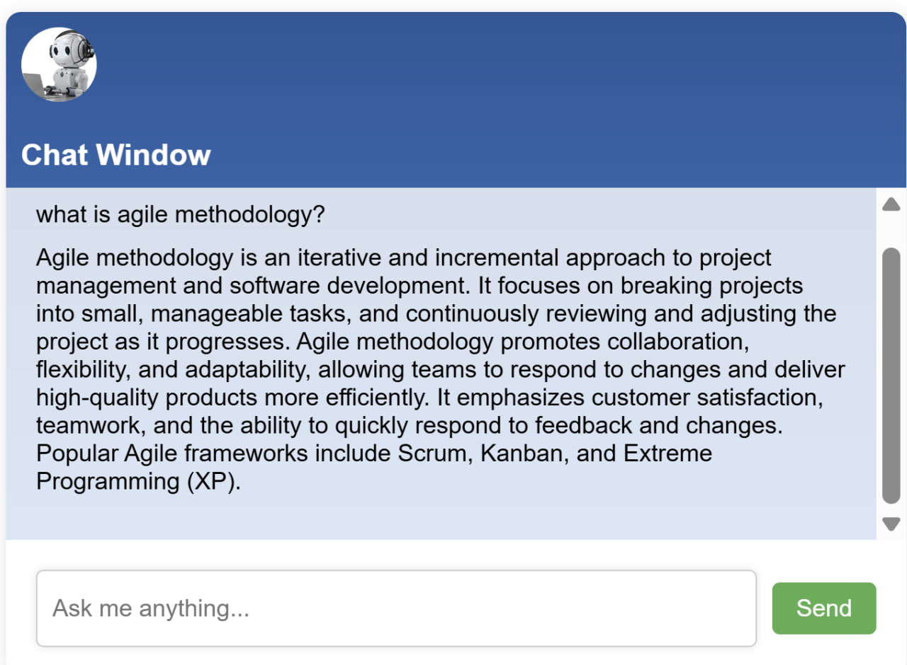

# Software Development Chatbot Using OpenAI API

A simple web-based chatbot that answers software development questions using the OpenAI API.
Built with **Node.js**, **Express.js**, and a lightweight **HTML/CSS/JavaScript** front end.

## Features

* Chat interface built with HTML/CSS/JS.
* Express.js backend that handles API requests.
* Integration with OpenAI’s GPT model for responses.
* Minimal UI with a custom logo.
* Runs locally with your own API key.

## Project Structure

```
chatbot-openAI/
│
├── public/                # Frontend files
│   ├── index.html         # Chat UI
│   ├── style.css          # Styles
│   ├── main.js            # Frontend logic
│   └── chat.png           # Logo
│
├── openai.js              # OpenAI API wrapper
├── server.js              # Express.js server
├── package.json           # Project dependencies
└── README.md
```

## Getting Started

### 1. Clone this repository

```bash
git clone https://github.com/Helia-Karisani/chatbot-openAI.git
cd chatbot-openAI
```

### 2. Install dependencies

Make sure [Node.js](https://nodejs.org/) is installed, then run:

```bash
npm install
```

### 3. Set your OpenAI API key

Create a `.env` file in the root of the project and add:

```
OPENAI_API_KEY=your_api_key_here
```

Or set it in your terminal session:

```bash
export OPENAI_API_KEY="your_api_key_here"   # Mac/Linux
setx OPENAI_API_KEY "your_api_key_here"     # Windows (PowerShell)
```

### 4. Start the server

```bash
node server.js
```

### 5. Open the app

Go to [http://localhost:3000](http://localhost:3000) in your browser.

## Usage

Type a question in the input box (e.g., *"What is the difference between a stack and a queue?"*) and press **Send**.

## Demo


## Technologies Used

* **Node.js**
* **Express.js**
* **OpenAI API**
* **HTML, CSS, JavaScript**

## Notes

* You need to supply your own OpenAI API key.
